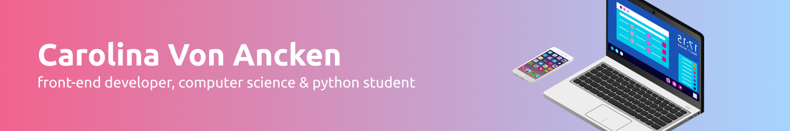

---

  

  
  
  

# about me . . . 🌐

I'm a 20-year-old Computer Science student with a deep passion for technology and programming. I love exploring new tools, learning different programming languages, and building projects that can make a difference in people's lives.  Currently, I work as a young apprentice at Gerdau, where I’m gaining practical experience and improving my skills every day.

I’m a problem solver by nature, curious about how things work, and always eager to learn more.  Beyond coding, I enjoy reflecting on life, reading, and finding creative ways to improve myself and help those around me. I also deeply value family — one of my biggest motivations is to provide a better life for my mom.  

# status . . . 📈

 &nbsp;&nbsp;&nbsp;&nbsp; 

<picture align="center">

</picture>

#

  
*eat, sleep, code, repeat... 🎮*

